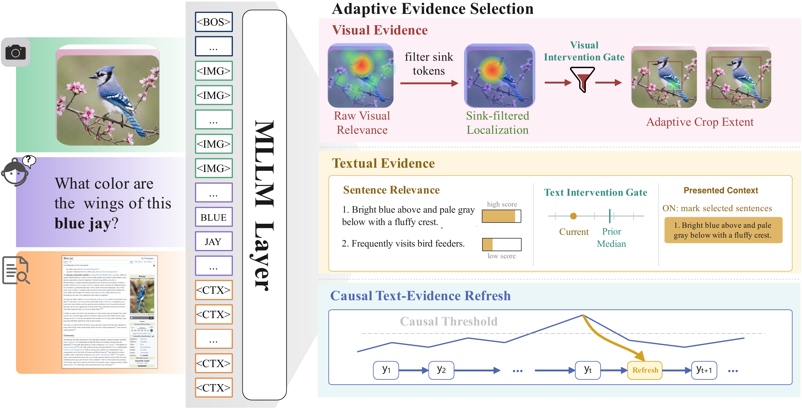

# AREA

Code for **Layers, Sinks, and Scaling: Adaptive Evidence Selection for Multimodal Large Language Models**.

AREA implements adaptive evidence selection for frozen multimodal large language models (MLLMs). This repository includes the inference implementation, dataset adapters, evaluation utilities, and benchmark configurations.

## Framework

[](docs/images/framework.pdf)

A single probe pass drives layer-resolved evidence readout, adaptive scaling, and modality-specific gating. Causal text-evidence refresh updates textual evidence during generation. Click the figure to view the original PDF from the paper.

## Contents

- AREA inference for frozen multimodal large language model (MLLM) checkpoints.
- Layer-Resolved Evidence Readout, Entropy-Calibrated Evidence Scaling, Modality-Specific Intervention Gating, and Causal Text-Evidence Refresh.
- Dataset adapters and evaluation code for E-VQA, InfoSeek, ViQuAE, RealWorldQA, V*, TextVQA, ChartQA, OCRBench, POPE, and AMBER-D.
- Parameterized benchmark configurations and a unified launch script.

Datasets and model checkpoints must be provided separately. Configure their locations as described below.

## Environment Setup

Clone the repository and enter its root directory:

```bash
git clone https://github.com/wongzbb/AREA.git
cd AREA
```

Install the runtime dependencies and the English spaCy model:

```bash
pip install -r requirements.txt
python -m spacy download en_core_web_sm
```

Set the local paths and execution options. `AREA_DATA_ROOT` must point to the directory containing `datasets/`:

```bash
export AREA_DATA_ROOT=/path/to/data-root
export MODEL=/path/to/model-checkpoint
export CUDA_VISIBLE_DEVICES=0
export OUTPUT_ROOT=./outputs
```

All YAML paths use `$AREA_DATA_ROOT` and are expanded by `run.py` at runtime. An editable variable template is provided in `env.example`.

## Running

Run a configured benchmark with:

```bash
bash scripts/run_dataset.sh vstar
```

The launcher accepts the name of any configuration in `configs/`, writes predictions under `$OUTPUT_ROOT`, and invokes the corresponding evaluator. Set `EVALUATE=0` to skip evaluation.

For AMBER-D evaluation, also set:

```bash
export AMBER_ANNOTATION=/path/to/annotations.json
```

## Retrieval

Vision-only benchmarks do not require a retriever, and the repository includes the ViQuAE retrieval adapter. For image-index retrieval on E-VQA and InfoSeek, set `AREA_RETRIEVER_DIR` to a directory containing a compatible `retriever.py`; when it is unset, the implementation uses its configured knowledge-base fallback.

## Reproducibility

AREA uses frozen MLLM checkpoints. The configuration files specify the data split, generation length, retrieval mode, and AREA hyperparameters. `PART`, `TOTAL_PART`, and `MAX_SAMPLES` can partition an evaluation run or limit its sample count.
